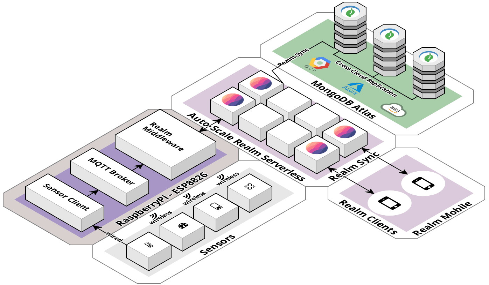
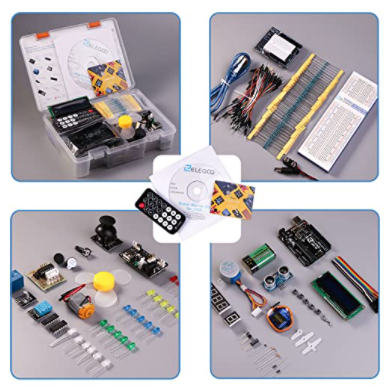
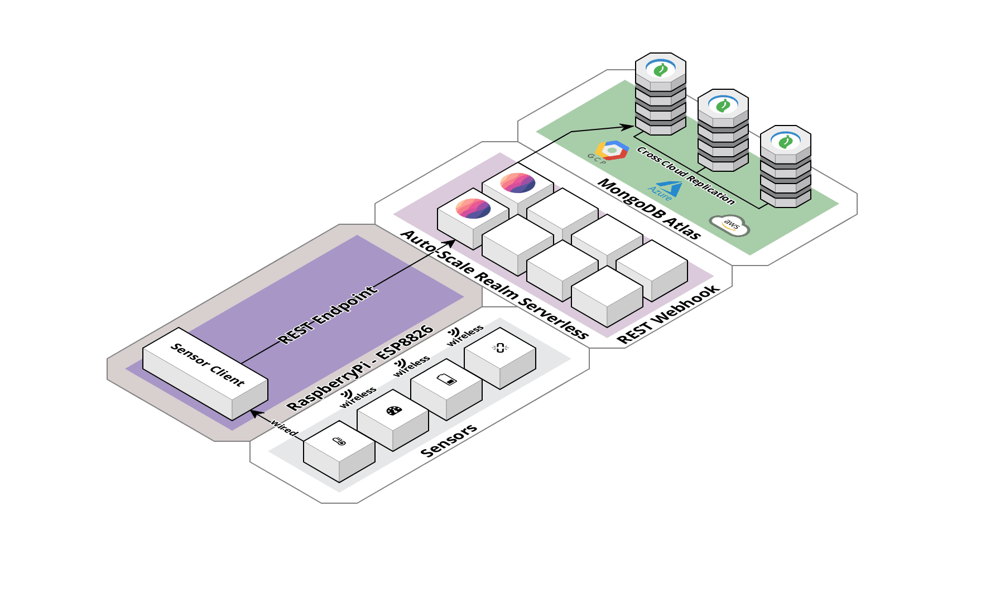
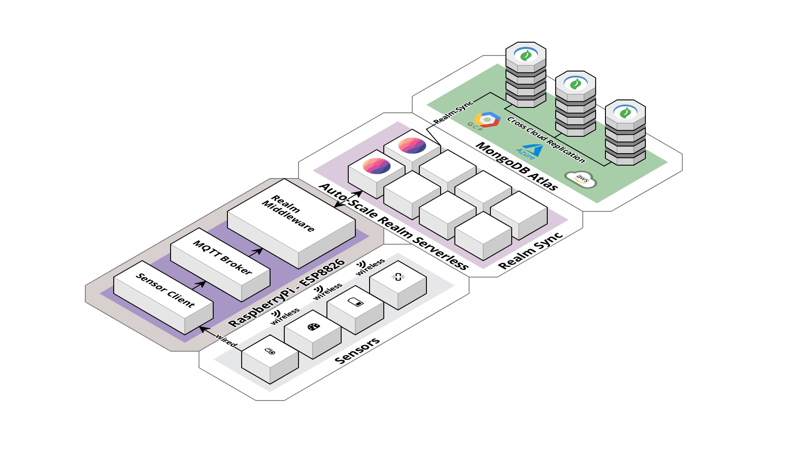

# Realm IOT

## Overview
MongoDB Realm sync is a poewerful tool that has now been brought to the world of IOT usecases.  In this example we use a DHT11 sensor and a Raspbery Pi to send temperature and humidity data from a delivery truck as part of solution to a cold chain logistics problem.


## Hands On Lab
In this "hands on lab" we will create our own full featured IOT sensor device that will send data from a remote IOT device to MongoDB Atlas. After setting up our Raspberry pi and wiring inthe DHT 11 Sensor. We will begin with a simple python script that sends data directly to MongoDB via a REST API webhook.  We will then enhance this simple code to retry sending its data in the event of a network outage. Finally we will upgrade our simple script to talk to an MQTT Broker which will send data to the Realm Middleware which will guarantee delivery and bi-directional communication with MongoDB Atlas. The MQTT broker and Realm Middleware opens a whole new world of possibilities where configuration changes and upgrades can be passed down to remote IOT devices rather than a one way sending of sensor data from the IOT device.   
   
 

## Getting Started

### Purchase IOT Equipment
You will need a Rasbery Pi 4 and a DHT11 Temperature sensor along with some wiring.  For a little extra you can get a whole kit with multiple sensors a bread board and all the wiring you will need with the purchase of an Elegoo UNO R3 Starter Kit.  I selected the Pi 4 with 4GB, this githib has instructions for the Pi 4 with this configuration.  The details are in the Amazon links provided in the table below.

| Raspberry Pi Cana Kit | Elegoo UNO Starter Kit |
|-----------------------|------------------------|
|[Raspbery Pi with Cana Kit](https://www.amazon.com/CanaKit-Raspberry-4GB-Starter-Kit/dp/B07V5JTMV9/) | [ELEGOO UNO Project Super Starter Kit](https://www.amazon.com/ELEGOO-Project-Tutorial-Controller-Projects/dp/B01D8KOZF4/)|
| <a href="https://www.amazon.com/CanaKit-Raspberry-4GB-Starter-Kit/dp/B07V5JTMV9/" target="pi"></a>|<a href="https://www.amazon.com/ELEGOO-Project-Tutorial-Controller-Projects/dp/B01D8KOZF4/" target="pi"></a>|

### Configure the IOT Hardware

####  Rasperry Pi Cana Kit Installation Guide
When you first get the cana kit and the Raspbery Pi you will want to set it up.  You need to install the operating system and get the latest updates. I found that the rasbian operating system was pre-installed on the sd card and all I had to do was insert the card and perform an update. Watch the video below for step by step instructions.     
[Video: Setting up the Raspberry Pi 4](https://www.youtube.com/watch?v=BpJCAafw2qE&feature=youtu.be)   
[Instructions: Setting up the Rasperry Pi4](https://crosstalksolutions.com/getting-started-with-raspberry-pi-4/)   
   
####  Wiring the DHT11 Sensor to the Raspberry Pi
The DHT11 temperature sensor needs to be connected to the Rasperry PI GPIO pin out array.  To get an idea of what to do if this is your first time watch the following video:   
[DHT11 Raspery Pi Configurtaion](https://www.youtube.com/watch?v=GsG1OClojOk&feature=youtu.be) 

####  Write a python script to read sensor data
I will summarize the following link [DHT11 Coding](https://www.thegeekpub.com/236867/using-the-dht11-temperature-sensor-with-the-raspberry-pi/) below:


## Send IOT Data to Atlas

### First Version

Our first version of the code uses the Realm Serverless capability to create a webhook to receive the sensor data directly from the IOT device using nothing more thana REST API call.


```py
import Adafruit_DHT
import time
import requests
import datetime

DHT_SENSOR = Adafruit_DHT.DHT11
DHT_PIN = 4

while True:
    humidity, temperature = Adafruit_DHT.read(DHT_SENSOR, DHT_PIN)
    if humidity is not None and temperature is not None:
        sensorDate = datetime.datetime.now()
        ftemp = (temperature * 9/5)+32
        data = "{\"sensorId\":\"T89176\", \"temperature\":" +str(ftemp) +", \"humidity\":" + str(humidity) +", \"sensorDate\":\"" + str(sensorDate) + "\"}"
        print(data)
        url = 'https://webhooks.mongodb-realm.com/api/client/v2.0/app/inventory-hhsot/service/Receive-IOT-Data/incoming_webhook/IOT-WH'
        headers = {'content-type': 'application/json', 'Accept-Charset': 'UTF-8'}
        response = requests.post(url, data=data, headers=headers )
        for x in response:
            print(x)

    else:
        print("Sensor failure. Check wiring.");
    time.sleep(3);   
```   
   
It works!  But there are many problems with this code.  There is no error handling, so if the network goes down the code throws an error and stops working on the IOT device.  You have to connect to the IOT device to start again.  Even if there was error handleing there would be data loss for the entire time the network is down.

The network outage can be tested with the following code:   
   
```py
import os
import time

print("Shutting down wifi for 60 seconds")
cmd = 'sudo ifconfig wlan0 down'
os.system(cmd)

time.sleep(60)

cmd = 'sudo ifconfig wlan0 up'
os.system(cmd)
print("wifi back up")
```   
   

 

## Second Version
A second version of this code that handles errors and has built in retry logic is here.  It also batches the data.  If the sensor data is collected every 3 seconds then with a batch of 20 you can send data once a minute and still maintain the granualarity of each 3 second reading.   

You can access the second version of the code here.
https://github.com/brittonlaroche/realm-IOT/blob/main/python/readTempBatch.py

You can also run the wifi outage script and see that it will store and retry the data.  This is all well and good.  But it is severly lacking as it is only one way communication.  Imagine trying to change the configuration.  Maybe you have an upgrade or maybe you want to save money and batch the data so it sends once every five minutes.  Perhaps you want the sensor to only read once a minute.  How will you apply these changes?  Imagine going to thousands of devices to make the necessary upgrades. This solution is untenable in the long run and will quickly become a maintenance nightmare. Enter the next phase of our lab.  We will now enable an MQTT broker and the Realm Sync capabilities.

## Realm IOT MQTT
 
