# Realm IOT

## Overview
MongoDB Realm sync is a poewerful tool that has now been brought to the world of IOT usecases.  In this example we use a DHT11 sensor and a Raspbery Pi to send temperature and humidity data from a delivery truck as part of solution to a cold chain logistics problem.


## Hands On Lab
In this "hands on lab" we will create our own full featured IOT sensor device that will send data from a remote IOT device to MongoDB Atlas. After setting up our Raspberry pi and wiring inthe DHT11 temperature and humidity sensor, we will begin with a simple python script that sends data directly to MongoDB via2-docker-setup-broker.sh a REST API webhook.  We will then enhance this simple code to retry sending its data in the event of a local network outage. Finally, we will upgrade our simple script to talk to an MQTT Broker which will send data to the Realm Middleware which will guarantee delivery and bi-directional communication with MongoDB Atlas. The MQTT broker and Realm Middleware opens a whole new world of possibilities where configuration changes and upgrades can be passed down to remote IOT devices rather than a one way sending of sensor data from the IOT device.   
   
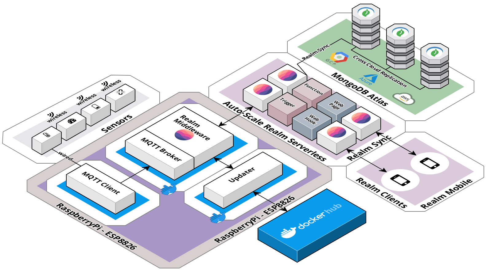 

## Getting Started

### Purchase IOT Equipment
You will need a Rasbery Pi 4 and a DHT11 Temperature sensor along with some wiring.  For a little extra you can get a whole kit with multiple sensors a bread board and all the wiring you will need with the purchase of an Elegoo UNO R3 Starter Kit.  I selected the Pi 4 with 4GB, this githib has instructions for the Pi 4 with this configuration.  The details are in the Amazon links provided in the table below.

| Raspberry Pi Cana Kit | Elegoo UNO Starter Kit |  SenseHat |
|-----------------------|------------------------|-----------|
|[Raspbery Pi with Cana Kit](https://www.amazon.com/CanaKit-Raspberry-4GB-Starter-Kit/dp/B07V5JTMV9/) | [ELEGOO UNO Project Super Starter Kit](https://www.amazon.com/ELEGOO-Project-Tutorial-Controller-Projects/dp/B01D8KOZF4/)|[SenseHat](https://www.amazon.com/gp/product/B014HDG74S/)
| <a href="https://www.amazon.com/CanaKit-Raspberry-4GB-Starter-Kit/dp/B07V5JTMV9/" target="pi"></a>|<a href="https://www.amazon.com/ELEGOO-Project-Tutorial-Controller-Projects/dp/B01D8KOZF4/" target="pi"></a>|<a href="https://www.amazon.com/gp/product/B014HDG74S/" target="pi">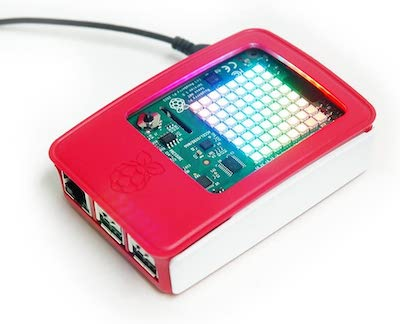 

### Configure the IOT Hardware

####  Rasperry Pi Cana Kit Installation Guide
When you first get the cana kit and the Raspbery Pi you will want to set it up.  You need to install the operating system and get the latest updates. I found that the rasbian operating system was pre-installed on the sd card and all I had to do was insert the card and perform an update. Watch the video below for step by step instructions.
|Getting Started Video|Getting Started Blog & Video|
|--------------|---------------|
|[Video: Setting up the Raspberry Pi 4](https://www.youtube.com/watch?v=BpJCAafw2qE&feature=youtu.be)|[Instructions: Setting up the Rasperry Pi4](https://crosstalksolutions.com/getting-started-with-raspberry-pi-4/)|
|<a href="https://www.youtube.com/watch?v=BpJCAafw2qE&feature=youtu.be" target="video"></a>|<a href="https://crosstalksolutions.com/getting-started-with-raspberry-pi-4/" target="blog">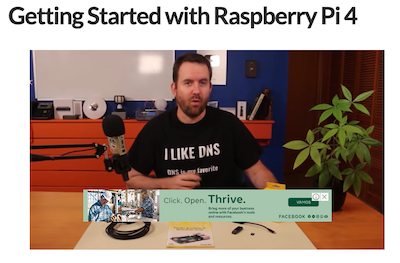</a>|

After assempling the Raspberry Pi cana Kit, insert the SD card, plug in a monitor, mouse and keyboard and power it on.  Once inside the rasbian operating system open the terminal window and run the following command:   
   
```   
sudo apt-get update && sudo apt-get upgrade -y
```   

It will take serveral minutes to apply all the updates.
   
####  Wiring the DHT11 Sensor to the Raspberry Pi
Open the ELEGOO UNO Project Super Starter Kit with UNO R3 and find the DHT11 sensor and take 3 female to female wiring connections. 
|DHT11 Temperature and humidity Sensor|
|-------------------------------------|
|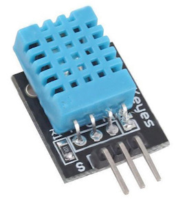|


The DHT11 temperature sensor needs to be connected to the Rasperry PI GPIO pin out array.  To get an idea of what to do if this is your first time watch the following video: [DHT11 Raspery Pi Configurtaion](https://www.youtube.com/watch?v=GsG1OClojOk&feature=youtu.be) 

We will need to connect the DHT11 sensor to the right GPIO pins on the Raspberry Pi.  To get a listing of your specific Rasperry pi and its GPIO pin configuration you can type "pinout" from the pi terminal.  You will get a beatifully colored ASCII art map like the following:

|PI Board|GPIO Pins|
|-------------|------------------|
|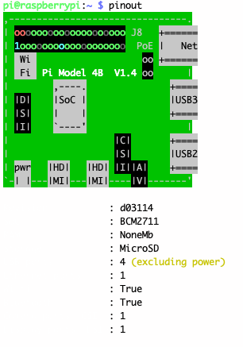|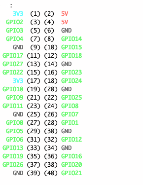|

|DHT11 GPIO Wiring Diagram|
|-------------------------|
|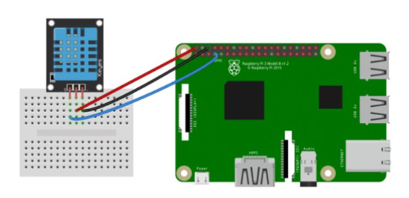|

We are not going to use the bread board.  Instead we will wire the DHT11 sensor directly to the Raspbery Pi GPIO board using the female to female conector wires we took from the ELEGOO UNO Project Super Starter Kit as seen below:

|Pi with Cana Kit Open | Pi with Cana Kit Closed|
|----------------------|------------------------|
|<a href="./img/PIKitOpenLarge.jpg" target="large">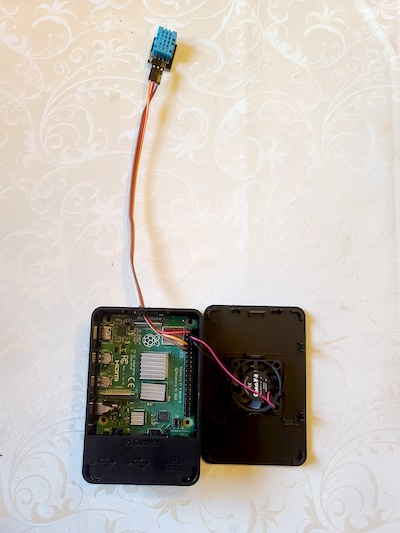</a>|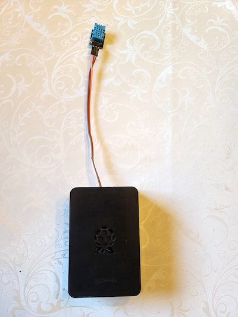|

The exact wiring for my particluar set up allowed me to include the Cana kit fan.  My wiring is as follows:
|DHT11 Pin| Wire Color|Raspberry Pi GPIO Pin| Pin Number|
|---------|---------|---------|---------|
|[Left] Data Pin| Orange| GPIO4 | (7)|
|[Middle] Power| Red | --- |(2)|
|[Right] Ground| Brown| --- |(9)|

|Cana Kit Fan| Wire Color|Raspberry Pi GPIO Pin| Pin Number|
|---------|---------|---------|---------|
|Power Wire | Red| --- | (4)|
|Ground Wire| Black| --- |(6)|

####  Write a python script to read sensor data
I will summarize the following link [DHT11 Coding](https://www.thegeekpub.com/236867/using-the-dht11-temperature-sensor-with-the-raspberry-pi/) below:

PYTHON CODE FOR RASPBERRY PI DHT11/DHT22
Next thing we need to do is install the DHT python library. This is done by entering  the following command:
```
sudo pip3 install Adafruit_DHT
```
Note: If you run into problems with the above command, you may not have PIP installed on your Pi.  You can fix that by running the following commands.  These will install PIP and other utilities you may need.
   
```
sudo apt-get install python3-dev python3-pip
sudo python3 -m pip install --upgrade pip setuptools wheel
```


## Send IOT Data to Atlas

### First Version

Our first version of the code uses the Realm Serverless capability to create a webhook to receive the sensor data directly from the IOT device using nothing more thana REST API call.

 

```py
import Adafruit_DHT
import time
import requests
import datetime

DHT_SENSOR = Adafruit_DHT.DHT11
DHT_PIN = 4

while True:
    humidity, temperature = Adafruit_DHT.read(DHT_SENSOR, DHT_PIN)
    if humidity is not None and temperature is not None:
        sensorDate = datetime.datetime.now()
        ftemp = (temperature * 9/5)+32
        data = "{\"sensorId\":\"T89176\", \"temperature\":" +str(ftemp) +", \"humidity\":" + str(humidity) +", \"sensorDate\":\"" + str(sensorDate) + "\"}"
        print(data)
        url = 'https://webhooks.mongodb-realm.com/api/client/v2.0/app/inventory-hhsot/service/Receive-IOT-Data/incoming_webhook/IOT-WH'
        headers = {'content-type': 'application/json', 'Accept-Charset': 'UTF-8'}
        response = requests.post(url, data=data, headers=headers )
        for x in response:
            print(x)

    else:
        print("Sensor failure. Check wiring.");
    time.sleep(3);   
```   

if you get the error: "cannot import name 'Beaglebone_Black_Driver' from 'Adafruit_DHT'" then the following instructions will show how to add the proper entry for the DHT settings.

In "/usr/local/lib/python3.7/dist-packages/Adafruit_DHT/platform_detect.py", you can add the followings at line #112 in the elif ladder, so it should workaround the issue. 

```
elif match.group(1) == 'BCM2711':
    return 3
```

It works!  But there are many problems with this code.  There is no error handling, so if the network goes down the code throws an error and stops working on the IOT device.  You have to connect to the IOT device to start again.  Even if there was error handleing there would be data loss for the entire time the network is down.

The network outage can be tested with the following code:   
   
```py
import os
import time

print("Shutting down wifi for 60 seconds")
cmd = 'sudo ifconfig wlan0 down'
os.system(cmd)

time.sleep(60)

cmd = 'sudo ifconfig wlan0 up'
os.system(cmd)
print("wifi back up")
```   
   


## Second Version
A second version of this code that handles errors and has built in retry logic is here.  It also batches the data.  If the sensor data is collected every 3 seconds then with a batch of 20 you can send data once a minute and still maintain the granualarity of each 3 second reading.   

You can access the second version of the code here.   
https://github.com/brittonlaroche/realm-IOT/blob/main/python/readTempBatch.py

You can also run the wifi outage script and see that it will store and retry the data.  This is all well and good.  But it is severly lacking as it is only one way communication.  Imagine trying to change the configuration.  Maybe you have an upgrade or maybe you want to save money and batch the data so it sends once every five minutes.  Perhaps you want the sensor to only read once a minute.  How will you apply these changes?  Imagine going to thousands of devices to make the necessary upgrades. This solution is untenable in the long run and will quickly become a maintenance nightmare. Enter the next phase of our lab.  We will now enable an MQTT broker and the Realm Sync capabilities.

## Realm IOT MQTT
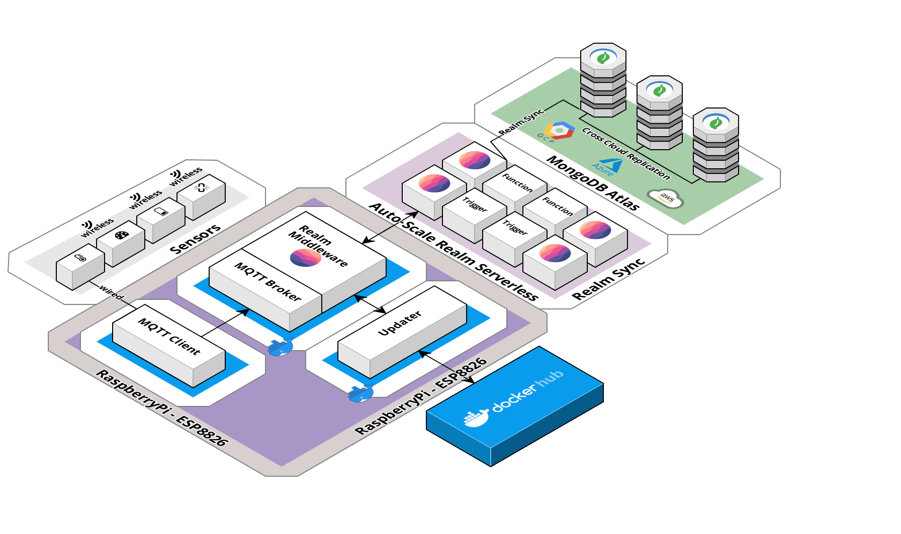 


### Learning Journey


| Node.js | MQTT Broker | MQTT Client| Docker |
|---------|-------------|------------|--------|
|<a href="https://www.youtube.com/watch?v=TlB_eWDSMt4" target="video">Intro Video</a>   <a href="https://codewithmosh.com/p/the-complete-node-js-course" target="video">   Complete Course</a>|<a href="https://www.youtube.com/watch?v=eS4nx6tLSLs" target="video">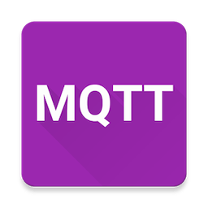   What is MQTT?</a>   <a href="https://www.youtube.com/watch?v=WmKAWOVnwjE" target="video">   MQTT Broker</a>|<a href="https://www.youtube.com/watch?v=c_DPKujOmGw" target="video">   Short Client Video</a>   <a href="https://youtu.be/QAaXNt0oqSI" target="video">   Detailed Client Video</a>|<a href="https://youtu.be/ASNL27a7sE4" target="video">   Short Docker Video</a>   <a href="https://www.youtube.com/watch?v=fqMOX6JJhGo" target="video">   Complete Docker Course</a>|The Realm MQTT framework runs on node.js.  If you are not familiar with node.js then I recommend the following video to learn the basics: [Node.js Tutorial for Beginners: Learn Node in 1 Hour](https://www.youtube.com/watch?v=TlB_eWDSMt4) A full course with RESTful APIs with Node, Express, and MongoDB is here: [The Complete Node.js Course](https://codewithmosh.com/p/the-complete-node-js-course)| If you are not familiar with MQTT here is a great getting started videos: [What is MQTT?](https://www.youtube.com/watch?v=eS4nx6tLSLs) [What is the MQTT Broker?](https://www.youtube.com/watch?v=WmKAWOVnwjE)  | In our example we are using python libraries to read the sensor data and node.js to run the MQTT Broker and realm Middleware.  The simpliest solution is to create a python MQTT client.  Short videos here:[MQTT Clients in Python with the paho-mqtt module](https://www.youtube.com/watch?v=c_DPKujOmGw) and here: [How to Use the Paho Python MQTT Client- (Beginners Guide)](https://youtu.be/QAaXNt0oqSI) |  The basic introduction to docker is here [Docker Hub Introduction Tutorial](https://youtu.be/ASNL27a7sE4) |


### Install the Realm MQTT Broker and middleware   
   
Note: This section requires the realm mqtt libraries which will be found [here](https://bitbucket.org/We-Kan-Code/aedes-realm/src/master/) in the near future.   
Perform a gitclone by running the shell command below or download the zip file.
   
```shell
git clone https://brittonlaroche@bitbucket.org/We-Kan-Code/aedes-realm.git
```   
   
### Import the realm application with the realm-cli on your laptop

Note these realm-cli steps must be perofrmed on your laptop / desktop. The realm-cli is 64 bit and will not run on the PI's 32 bit operating system.   
   
   
https://docs.mongodb.com/realm/deploy/realm-cli-reference#import-an-application    
The link above will show you how to install the realm-cli   

Navigate to the realm application services directory and change the cluster name to your cluster name in the config.json file
```
cd [your install directory]/aedes-realm/realm-app-configuration/services/app0
vi config.json

{
    "id": "5fc9fb09075d213dc5dc6f14",
    "name": "app0",
    "type": "mongodb-atlas",
    "config": {
        "clusterName": "YOUR_CLUSTER_NAME",
        "readPreference": "primary",
        "sync": {
            "state": "enabled",
            "database_name": "iot-reference",
            "partition": {
                "key": "partitionKey",
                "type": "string",
                "permissions": {
                    "read": true,
                    "write": true
                }
            }
        },
        "wireProtocolEnabled": false
    },
    "version": 1
}
```


    
Navigate back to the realm application directory
```
cd [your install directory]/aedes-realm/realm-app-configuration
```
   
Example below (Dont worry, the real API key was not pasted. It is an example)   
   
```
realm-cli login  --api-key=bwpbsexy --private-api-key=c53f6baf-f7b5-41fe-b56f-2ac1ba244b19
realm-cli import --app-id=realm-mqtt --path=./ --strategy=replace

Unable to find app with ID: "realm-mqtt": would you like to create a new app? [y/n]: y
App name [Application-0]: realm-mqtt
Available Projects:
RealmDemo - 5f03a788aeb72067f2b7c5cb
Atlas Project Name or ID [RealmDemo]:
Location [US-VA]:
Deployment Model [GLOBAL]:
New app created: realm-mqtt-icbmx
Creating draft for app...
Draft created successfully...
Importing app...
Deploying app...
Deploying app...
...
Done.
Successfully imported 'realm-mqtt-icbmx'
```

#### Add an Edge device to the Edges collection in the iot_refernce database
Open the atlas collection browser to the iot-refrence database and insert the following edge device entry into the edges collection:   

```
{
	"_id" : ObjectId("5fcd91f4a32cf1f25490059d"),
	"edgeId" : "4fef2031-5e39-43c9-9a20-3517019b9ce9",
	"compactSize" : 100,
	"edgeName" : "Home Edge",
	"updateDay" : 0,
	"updateTime" : "10:05:44",
	"sensors" : [
		{
			"sensorType" : "temperature",
			"isConfigured" : false,
			"_id" : ObjectId("5fcd9205333a5e319c94453a"),
			"sensorName" : "Living Room Temperature Sensor",
			"threshold" : "0",
			"sensorId" : "af4ff76b-009b-4cc4-8dfe-c058d1d030c9"
		},
		{
			"sensorName" : "Living Room Humidity Sensor",
			"threshold" : "0",
			"sensorId" : "a27179de-fae5-4b58-ad8f-d839ae755c9b",
			"sensorType" : "humidity",
			"isConfigured" : false,
			"_id" : ObjectId("5fc4cca74d700e0829fc9b74")
		}
	],
	"updateImageName" : null,
	"lastUpdateDt" : ISODate("2020-12-28T07:30:00.716Z"),
	"partitionKey" : null
}
```

### Build the docker images on your laptop
Docker's new buildx is used to build the images. The newer versions of docker (19.03+) have buildx bundled together but you may need to enable it to actually build images. This [link](https://docs.docker.com/buildx/working-with-buildx/) shows you how to enable buildx.

If you have not done so already you will need to create a docker hub account: https://hub.docker.com/    
And install docker: https://docs.docker.com/get-docker/   
   

The next step is to setup [qemu-user-static](https://github.com/multiarch/qemu-user-static).

```shell
docker run --rm --privileged multiarch/qemu-user-static --reset -p yes
```


This lets you build arm images on your system.

The docker build scripts found under each service lets you quickly build the image and push it to Dockerhub. You'll need to login with your Dockerhub credentials before you can push the images. These scripts also take in a tag for the image as an input


```shell
cd [your install directory]/aedes-realm/broker
./docker-build-armv7.sh v0.1.0-armv7
```   
   
If auto push is not enabled on your system you can manually build and push your files.    
Start with building the realm mqtt broker.   
    
```shell
cd [your install directory]/aedes-realm/broker
docker buildx build -t realm-aedes-broker . --platform linux/arm/v7

docker images
docker tag realm-aedes-broker:latest zencoder76/realm-aedes-broker
docker push zencoder76/realm-aedes-broker
```   
   
Additionally, you can add a version tag:   
   
```shell   
docker tag realm-aedes-broker:latest zencoder76/realm-aedes-broker:v0.1.0-armv7
docker push zencoder76/realm-aedes-broker:v0.1.0-armv7
```   
    
Build and push the updater    
   
```shell
cd [your install directory]/aedes-realm/updater
docker buildx build -t realm-aedes-updater . --platform linux/arm/v7

docker images
docker tag realm-aedes-broker:latest zencoder76/realm-aedes-updater
docker push zencoder76/realm-aedes-updater
docker tag realm-aedes-broker:latest zencoder76/realm-aedes-updater:v0.1.0-armv7
docker push zencoder76/realm-aedes-updater:v0.1.0-armv7
```   

   
If you have the SenseHat build and push the client   
   
```shell
cd [your install directory]/aedes-realm/clients/sensehat
docker buildx build -t realm-aedes-sensehat-client . --platform linux/arm/v7

docker images
docker tag realm-aedes-sensehat-client:latest zencoder76/realm-aedes-sensehat-client
docker push zencoder76/realm-aedes-sensehat-client
docker tag realm-aedes-sensehat-client:latest zencoder76/realm-aedes-sensehat-client:v0.1.0-armv7
docker push zencoder76/realm-aedes-sensehat-client:v0.1.0-armv7
```
   
### Prepare the PI
Note: This section requires the realm mqtt libraries which will be found [here](https://bitbucket.org/We-Kan-Code/aedes-realm/src/master/) in the near future.   
Perform a gitclone by running the shell command below or download the zip file.
   
```shell
git clone https://brittonlaroche@bitbucket.org/We-Kan-Code/aedes-realm.git
```   
   
With the OS installed and bitbucket git cloned, the next step would be to install Docker. Open up a terminal on your Raspberry PI and run the below commands
```
sudo apt-get update && sudo apt-get upgrade
curl -fsSL https://get.docker.com -o get-docker.sh
sudo sh get-docker.sh
```
   
Add a non-root user to the Docker group
```
sudo usermod -aG docker pi
```   
   
Login to docker  
   
```shell
pi@raspberrypi:~ $ docker login
Login with your Docker ID to push and pull images from Docker Hub. If you don't have a Docker ID, head over to https://hub.docker.com to create one.
Username: zencoder76
Password:
WARNING! Your password will be stored unencrypted in /home/pi/.docker/config.json.
Configure a credential helper to remove this warning. See
https://docs.docker.com/engine/reference/commandline/login/#credentials-store

Login Succeeded
```   
   
Pull the docker images we just created.    
   
```shell
pi@raspberrypi:~ $ docker pull zencoder76/realm-aedes-updater
\Using default tag: latest
latest: Pulling from zencoder76/realm-aedes-updater
71728559ce1f: Pull complete
ac621a7031da: Pull complete
c80cb094ef96: Pull complete
64bdfe3d9810: Pull complete
0fe7aa12a8c5: Pull complete
a14935c29500: Pull complete
7ae38e22e69e: Pull complete
060ccc365748: Pull complete
Digest: sha256:de92068c176fdddffe1381543666eb8765686bc37a92e3360e5814c23d66957b
Status: Downloaded newer image for zencoder76/realm-aedes-updater:latest
docker.io/zencoder76/realm-aedes-updater:latest
```
Repeat the process for the broker and client images.

### Setting up the containers on the RPI
Once the images are up on Dockerhub, you can get started on setting up the services on the edge. The services have a few configurable parameters than need to be passed in as environment variables to the container. In particular, the Realm app information needs to be updated in broker.env and updater.env found under ./setup/configuration.  The setup configuration is under the same directory where the bitbucked git clone was installed.
   
```shell
cd [your git clone dir]/aedes-realm/setup/configuration
```   
   

```
vi broker.env 
   
# Realm app info
REALM_APP_ID=
REALM_EMAIL=
REALM_PASSWORD=
```   
   
These .env files also have a few additional configurable parameters you can tweak as needed.   
   
You can now spin up the services using the below scripts.  

```shell
cd [your git clone dir]/aedes-realm/setup
chmod 755 *
```
   
```shell
./1-docker-setup-network.sh
./2-docker-setup-updater.sh v0.1.0-armv7
./3-docker-setup-broker.sh v0.1.2-armv7
./4-docker-setup-sensehat-client.sh v0.1.0-armv7
```
All but the setup network script take in tags as arguments. These are used to pull in specific images from Dockerhub.  For our example we don't need the tags.  You may need to change out the docker name from wekancode123 to your docker username (mine is zencoder76).  The 3-docker-setup-broker.sh is provided as an example below.

```shell
#!/bin/bash
set -x #echo on
docker run \
  --privileged \
  --restart unless-stopped \
  --device /dev/fb0 \
  --device /dev/fb1 \
  --publish 1883:1883 \
  --publish 3000:3000 \
  --env-file ./configuration/broker.env \
  --network realm-aedes-net \
  --detach \
  --name broker zencoder76/realm-aedes-broker
```

if you get an error like the following:  
```
docker: Error response from daemon: error gathering device information while adding custom device "/dev/fb1": no such file or directory
```   
Make sure you include the "--privileged" flag to the 2-docker-setup-broker.sh script as the container needs access to the PI's devices.   
    
You can verify your containers are running by issuing the following commands:

```shell
docker ps -a
docker container ls -a
   
```
You can see the log files with the following commands:
   
```shell
pi@raspberrypi:~ $ docker ps -a
CONTAINER ID   IMAGE                           COMMAND                  CREATED        STATUS        PORTS                                            NAMES
654d9af79045   zencoder76/realm-aedes-broker   "docker-entrypoint.s…"   18 hours ago   Up 18 hours   0.0.0.0:1883->1883/tcp, 0.0.0.0:3000->3000/tcp   broker
pi@raspberrypi:~ $ docker logs 654d9af79045
```   
   
Additionally you can connect to the container in interactive mode:
   
```shell
docker exec -it broker /bin/bash
```   

You can learn how to start and stop containers on the PI by watching this video [here](https://eldermoraes.com/docker-basics-how-to-start-and-stop-containers/) If you need help debugging a crashed docker container, take a look at this article [here](https://medium.com/@pimterry/5-ways-to-debug-an-exploding-docker-container-4f729e2c0aa8)


## Creating a Python MQTT client  
   
We may not choose to use the SenseHat prebuilt node libraries for a variety of reasons.  Many of the MQTT forums are asking for a generic python client. We have decided to create one here to use the Realm MQTT Broker. This allows for a varierty of sensors and diffrent form factors not included in the SenseHat.   
   
We begin by installing the python libraries for paho-mqtt on the raspberry pi. We do this by running the following from the command line:   
   
```
sudo pip install paho-mqtt
```
All of the python scripts used in this git hub are located here:   
https://github.com/brittonlaroche/realm-IOT/blob/main/python/   
    
You can use the nano editor on the PI to create the following python MQTT client: mqtt-client.py   
   
```shell
nano mqtt-client.py
```       
   
Copy and paste the code below (beware the html tabs and spaces in github may mess with python) raw code here: [mqtt-client.py](https://raw.githubusercontent.com/brittonlaroche/realm-IOT/main/python/mqtt-client.py)
   
```python
import Adafruit_DHT
import time
import requests
import datetime
import paho.mqtt.client as paho
import sys
DHT_SENSOR = Adafruit_DHT.DHT11
DHT_PIN = 4


client = paho.Client()

# Python is host, port, timeout in seconds
if client.connect("localhost",1883,10) != 0:
    print("Could not connect to MQTT Broker")
    sys.exit(-1)

while True:
    humidity, temperature = Adafruit_DHT.read(DHT_SENSOR, DHT_PIN)
    if humidity is not None and temperature is not None:
        sensorDate = datetime.datetime.now()
        ftemp = (temperature * 9/5)+32
        #data = "{\"sensorId\":\"T89176\", \"temperature\":" +str(ftemp) +", \"humidity\":" + str(humidity) +", \"sensorDate\":\"" + str(sensorDate) + "\"}"
        now = int(datetime.datetime.utcnow().timestamp())
        message = "{\"sensorType\":\"temperature\",\"sensorId\":\"af4ff76b-009b-4cc4-8dfe-c058d1d030c9\",\"tempCelsius\":"+ str(temperature) +",\"tempFahrenheit\":"+ str(ftemp) +",\"timestamp\":" + str(now) +"}"
        print(message)
        client.publish("dht/temperature", message)
    else:
        print("Sensor failure. Check wiring.")
    time.sleep(3)
 ```
 
    
After starting the mqtt broker you can start the mqtt python client with the following command:   
   
```shell
python3 mqtt-client.py
```   
   
Also worth noting, there is a simple [mqtt-pub.py](https://github.com/brittonlaroche/realm-IOT/blob/main/python/mqtt-pub.py) and [mqtt-sub.py](https://github.com/brittonlaroche/realm-IOT/blob/main/python/mqtt-sub.py) script that you can install and use for easy testing of the realm mqtt broker.
